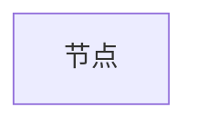
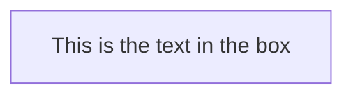

## 简介
所有流程图都由节点、几何形状和边缘、箭头或线条组成。代码图定义了这些节点和边的制作和交互方式。

它还可以容纳不同的箭头类型、多向箭头以及与子图的链接。

> 重要提示：请勿将“end”一词键入为流程图节点。将所有或任何一个字母大写以防止流程图中断，即“End”或“END”。

## 节点
节点是流程图中的基本元素，它们是在流程图中的一个点，可以是矩形，圆形，椭圆形，多边形，或者是圆角矩形等。
```text
flowchart LR
    id
```



## 带文本的节点
也可以在不同于 id 的框中设置文本。如果多次这样做，它将是为将使用的节点找到的最后一个文本。此外，如果您稍后为节点定义边，则可以省略文本定义。渲染框时将使用先前定义的那个。
```text
flowchart LR
    node[This is the text in the box]
```


