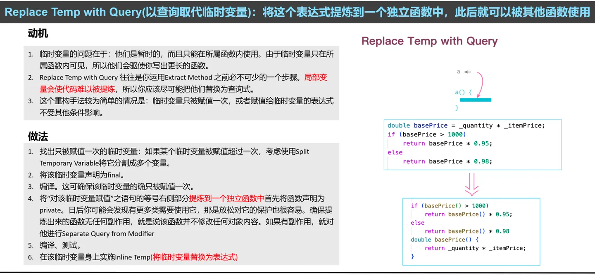

## 1.技术债务
先从技术债务讲起，正是因为有技术债务，所以要重构。

### 1.1.什么是技术债务
技术债务就像是为了**迅速解决问题而借的"债"**，这些"债"在未来的某个时候需要偿还，而且往往会附带额外的利息，即更高的维护成本和更大的修改难度

为什么会有技术债务？

实际工作中，因为种种原因，我们会为追求速度而牺牲代码质量、使用过时技术、做出折衷设计决策以及仅进行快速修复而非根本解决问题。总之一句话，为了赶进度而牺牲了质量。

常见的技术债务哪些？

+ 代码债务：包括质量不高的代码、缺乏必要注释、静态分析产生的警告以及不一致的编程风格，这些都增加了代码的理解和维护难度。  
  
+ 设计债务：涉及非最优的设计决策、设计上的"坏味道"以及不遵循既定的设计规则，这些问题可能导致系统架构僵化，难以适应未来的变化。  
  
+ 测试债务：指缺乏足够的测试、测试覆盖率不足或测试质量低下，这些问题会削弱对代码质量的信心，增加未来出现缺陷的风险。  
  
+ 文档债务：包括重要问题没有文档记录、文档过时或没有及时更新，这会影响团队成员对系统的理解和使用，降低开发效率。  
  

技术债务可能会造成诸多影响，其中最大的一个影响，就是修改成本的增加。有时候在一个老系统上，即便是增加一个很小的功能，都特别费劲，这就说明技术债太重了。

技术债务的潜在影响包括：

+ 维护成本上升：时间一长，一个补丁接一个补丁，修修补补的成本会越来越高。  
  
+ 新功能开发受限：系统变得越来越僵硬、不灵活，想要加点新功能进去，费时费力，需要投入很多人力  
  
+ 系统性能下降：技术债务像滚雪球一样越滚越大，系统跑得越来越慢，用户体验也越来越差  
  
+ 安全风险增加：用了过时的技术，或者存在安全漏洞，让黑客们有机可乘。

要点总结：

### 1.2.如何偿还技术债务
还债还是不还债，这是一个问题：

+ 如果不还债：权宜之计 -> 不断积累 -> 大代价/无法偿还 -> 技术破产（放弃产品）  
  
+ 如果还债：权宜之计 -> 及时偿还（需要投人投时间，有时候很难） -> 影响不大  
  

欠的债要还的，只是还起来是有挑战的，例如：

+ 缺乏工具：手上没有趁手的工具和平台，要搞清楚技术债务有多严重，很难很难  
  
+ 缺乏信心：面对那些老旧复杂的系统，开发人员心里也没底，没人敢轻易动那些"屎山代码"  
  
+ 领导层不关注：老板们关心的能不能按时交货、功能全不全，对于技术债，没太多心思  
  
+ 开发人员不重视：开发人员忙着完成任务，无暇关注那些技术债务的严重性，因此一拖再拖

由于种种原因，技术债务还起来是有挑战的，引入一些必要的方法，有助于打破这种僵局，例如 ：

+ **量化技术债务**：给技术债务算算账，看看它到底有多大、多贵，这样大家都能明白它的严重性了。  
  
+ **可视化技术债务**：把技术债务变成一张图，让不懂技术的人也能一眼看出问题所在，更容易达成共识。  
  
+ **展示代码质量趋势**：定期秀一秀代码质量的进步，让大家看到重构的效果，自然就有人支持了。  
  
+ **分批次小规模重构**：别总想着一步登天，慢慢来，一点点改善代码，这样风险小，也容易得到大家的信任。

下面是一个可视化的实例，重构之后的架构复杂度更低，模块内部高内聚，模块之间低耦合。

具体而言，如何消除技术债务，可以考虑从工具、流程、人员三个方面入手。

**工具方面：**

+ 理解工具：要想深入了解系统的架构和设计，我们得靠一些可视化的小工具。比如，控制结构可视化能让我们看清系统的骨架，数据传输流程分析能揭示数据是怎么在系统里跑的，调用序列分析和继承图则能展示函数和类之间的关系。有了这些工具，系统的运作方式就一目了然啦。  
  
+ 分析工具：有一些工具能自动评估代码的质量和找出潜在问题。设计评估工具能指出设计上的不足之处，代码分析工具则能发现源代码级别的bug。代码克隆检测器能迅速找到重复的代码段，这样我们就可以考虑重构它们以避免冗余。度量工具则用数字来说话，告诉我们问题的严重性和需要改进的地方。  
  
+ 量化和可视化：虽然量化技术债务有点困难，但现在也有一些工具在这方面做出了努力。它们能帮我们更明确地了解技术债务的规模和影响，这样我们就能更有针对性地进行改进。

**流程方面：**

+ 先找找问题：咱们得先看看源代码，找找哪里不对劲，需要动动手术。  
  
+ 定个小计划：找到问题后，得琢磨下怎么改，定个小计划，别改出乱子来。  
  
+ 动手改改看：计划好了，就放心大胆地改吧。有工具帮忙，应该问题不大。  
  
+ 测测看稳不稳：改完了得测测，确保没搞砸，系统还是跑得好好的。

**人员方面：**

+ 培训小课堂：团队里得有人懂设计原则、能看出设计上的怪味和怎么重构。开个小课堂，给大家普及普及，最好多来点实战演练。  
  
+ 分享小经验：搞个小研讨会或者讲座，让大家分享下自己是怎么重构的，遇到了什么问题，怎么解决的。这样大家都能学到点东西。  
  
+ 老大得带头：团队里的老大、导师或者小组长得先做个榜样，自己先重构起来，给大家树立个信心。这样整个团队才能更有动力去重构，去还技术债务。

### 1.3.IMPACT流程
将IMPACT流程应用于偿还技术债务：

**Impact = Identify + Mark + Plan + Act + Test**

简单说，就是先找出来、做个记号、定个计划、动手干、最后测一测。

**1. 找出来（Identify）**

先看看代码库、架构哪里有问题，哪些东西已经过时或者写得不太对。用工具帮忙也行，人工审查也行，总之得找出来。

**2. 做个记号（Mark）**

找到问题后，给它们分分类，排个优先级。就像给待办事项打标签一样，这样就知道哪些得赶紧处理，哪些可以缓缓。

**3. 定个计划（Plan）**

接下来，得想个办法解决这些问题。计划一下要怎么做、需要多少时间、可能会遇到什么麻烦。别瞎干，得有个方向。

**4. 动手干（Act）**

计划好了就开始干吧！按照计划一步一步来，改代码、优化性能、更新库什么的。注意别引入新问题哦！

**5. 测一测（Test）**

改完之后得测测看，确保一切正常。单元测试、集成测试都来一遍，性能和安全也别忘了。没问题了就可以放心交付啦！

就这样，跟着IMPACT流程走，技术债务慢慢还！

## 2.重构与质量
### 2.1.什么是重构
重构是啥？简单来说，就是改动软件内部的结构，让它更容易被人理解，也更容易去修改，但这些改动不会影响到软件外在的表现。记住，重构只是动结构，行为还是老样子。跟重构不一样的是重做，重做可是连行为都一起改了，是大换血哦！

### 2.2.什么是质量
设计质量，说白了就是你的设计好不好用、容不容易懂。好的设计质量得容易理解、好修改、方便扩展新功能，还能在不同情况下重复使用。而且，设计得好，测试找问题就方便，运行起来也更靠谱。

软件质量不行，后果很严重。有一组数据，在美国，每年因为软件质量问题就得损失1500亿美元，全球更是高达5000亿美元。这就是技术债务，做了错误或不是最好的设计决策，就像欠了债一样，迟早得还。

所以，设计质量真的很重要，关系到软件好不好用，也关系到你会不会背上技术债务。

### 2.3.重构改进质量
重构是为了消除坏味道，偿还技术债务。

为啥要关心那些设计上的"坏味道"呢？因为它们就像警示灯，告诉你设计可能有问题。比如设计太僵硬、难以改动，或者太复杂、重复太多。这些都会影响软件的质量，比如好不好用、容不容易懂、能不能重复使用。如果设计得不好，软件就可能难以维护，也不可靠。所以，关注并解决这些"坏味道"很重要，它们能让你的软件更健康、更好用。

消除了坏味道，则意味着好的设计质量，好的产品质量。

搞定了"坏味道"，设计质量自然就上去了，产品质量也跟着提升。好的设计质量就是软件容易懂、好扩展、方便测试、靠谱。好的产品质量呢，就是软件好维护，变动和扩展都轻松应对，而且运行稳定，不会动不动就出问题。

### 2.4.重构的范围与分类
重构这事儿，从宏观到微观，可以分成三个层次来看：架构、设计和代码。

+ **架构重构：**

这就像是给房子重新打地基、搭框架。你得看看整个软件是怎么搭起来的，各个大部件是怎么配合工作的。如果地基不稳、框架不合理，那房子就容易出问题。所以，架构重构就是重新调整整个软件的结构，让它更能适应未来的需求，更稳定、更灵活。这样，软件就能更好地应对各种挑战，跑得更欢了。

+ **设计重构：**

这就是在房子里调整家具摆放、优化空间布局了。你得看看各个类、方法是怎么设计的，它们之间是怎么交流的。如果家具摆放不合理、空间利用不充分，那住着就不舒服。所以，设计重构就是调整类的设计、交互方式以及它们之间的关系，让代码更简洁、更清晰、更易用。这样，软件就能更好地服务于用户，让他们用起来更顺手了。

+ **代码重构：**

这就是在房子里擦擦窗户、扫扫地了。你得关注代码的细节，看看哪些地方可以优化、哪些地方可以简化。如果代码写得乱七八糟、逻辑复杂难懂，那维护起来就头疼了。所以，代码重构就是提高代码的可读性、简化复杂逻辑、移除冗余代码、提高性能以及确保代码的安全性和健壮性。这样，软件就能更稳定地运行了，出了问题也容易找到原因并修复了。

### 2.5.重构的原则
+ **什么是重构**

重构，简而言之，是对软件内部的一种精细化调整，旨在不改变软件外在表现的前提下，提升其内部结构的清晰度和可维护性。这就像是对一座建筑进行内部翻新，虽然外观保持不变，但内部布局更加合理，居住体验得以提升。

+ **为什么重构**

在软件开发中，重构既是一种行为，也是一种结果。作为行为，它涉及对代码结构的审视和调整；作为结果，它呈现为更加优雅、高效的代码基。在重构过程中，我们通常需要区分两个阶段：一是添加新功能时的微调，此时我们尽量保持对既有代码的最小改动；二是专门的重构阶段，此时我们专注于改善代码结构，而不添加新功能。

+ **重构的价值**

重构的价值在于它能够显著改进软件设计，使代码更加易于理解、维护和扩展。通过重构，我们可以降低软件的复杂性，提高开发效率，减少bug的出现。此外，重构还有助于我们更好地掌握软件的设计模式，为未来的性能优化奠定坚实基础。

+ **重构的挑战**

然而，重构并非易事。它需要我们对代码有深入的理解，对设计有敏锐的洞察力。同时，我们还需要克服一些挑战，如代码所有权问题、分支管理困难以及测试不足等。为了确保重构的成功，我们需要遵循一些最佳实践，如"三次法则"（即当同样的代码问题出现三次时，考虑进行重构）以及有计划的重构策略。

+ **重构与设计**

值得注意的是，重构并不总是必要的。在某些情况下，过度重构可能会导致开发进度延迟或引入新的bug。因此，我们需要在重构与性能之间找到平衡，根据项目的实际情况和需求来决定何时进行重构。

总之，重构与设计是相互补充的。通过重构，我们可以降低设计的难度，提高代码的质量；而良好的设计则为重构提供了坚实的基础。在软件开发过程中，我们应该充分利用重构这一工具，不断提升代码的品质和可维护性。

## 3.码坏味道与重构
### 3.1.代码坏味道
代码坏味道就像是你走进一间屋子，突然闻到一股不太对劲的气味，让你直觉感觉有什么地方不对劲。在编程世界里，这种"不对劲"的感觉通常意味着代码有点问题，可能是可读性太差、维护起来太费劲，或者是扩展性不好。这时候，你就得像个侦探一样，顺着这些"坏味道"去找出问题所在，然后动手改进代码。

下面是15种你可能会遇到的常见代码坏味道，它们就像是给你的代码健康状况发出的警告信号：

1. **长方法**：一个方法写得老长老长，一眼望去全是代码，看得你眼花缭乱。这时候你就得考虑把它拆分成几个小方法，让每个方法都只负责一件事情，这样读起来就容易多了。  
   
2. **大类**：有些类就像是个全能选手，什么都能干，但结果就是变得臃肿不堪，难以管理。这时候你就得给它减减肥，让它只专注于一件事情，把其他功能交给别的类去处理。  
   
3. **重复代码**：你发现好多地方都写了同样的代码，就像是在不同地方都存了同样的备份一样。这样不仅浪费空间，还容易出错。赶紧找个时间把这些重复的代码整合到一起，写成一个公共的方法或者类吧。  
   
4. **参数列表过长**：一个方法要传入一大堆参数，看得你头都大了。这时候你就得想想，这个方法是不是承担了太多责任？能不能把它拆分成几个更小的方法？或者能不能用个对象来封装这些参数？  
   
5. **全局变量**：全局变量就像是个大家共享的果篮，谁都能来拿一拿、放一放。但这样一来，代码之间的耦合度就高了，测试起来也麻烦。所以还是尽量少用全局变量吧，尽量把变量限制在它们该待的地方。  
   
6. **可变数据**：有些对象的状态被改来改去，你都不知道它现在到底是个啥状态。这样很容易出错，也很难跟踪问题。所以最好还是让对象的状态保持稳定吧，不要轻易去修改它。  
   
7. **发散式变化**：你发现每次修改一个类的时候，总是因为各种不同的原因要改很多不同的地方。这时候你就得想想，这个类是不是承担了太多不相关的责任？能不能把它拆分成几个更小的、更专注的类？  
   
8. **霰弹式修改**：每次你要修改一个小小的功能，都得在好多个不同的类里面动刀子。这感觉就像是在玩打地鼠游戏一样，刚敲下去一个，另一个又冒出来了。这说明这些类之间可能存在不必要的耦合，你得想办法把它们解耦才行。  
   
9. **功能蔓延**：有时候你会发现一个方法里面大部分代码都在操作另一个类的数据和方法，而不是它自己的数据和方法。这感觉就像是这个方法"身在曹营心在汉"一样。这时候你就得考虑把这个方法移到它真正应该属于的那个类里面去。  
   
10. **数据泥团**：你发现好几个数据总是一起出现、一起传递，就像是一团泥巴一样粘在一起。这时候你就得想想能不能把它们封装到一个对象里面去，这样处理起来就方便多了。  
    
11. **基本类型偏执**：有些代码过度使用基本类型（比如int、string等），而不用更具描述性的类或对象来表示数据。这样一来，代码的可读性和可维护性就降低了。所以还是尽量用有意义的类或对象来表示数据吧。  
    
12. **死代码**：有些代码写在那里从来都没被用过，就像是一堆僵尸一样占着地方不干活。这样的代码留着也没用，还会增加维护的难度和出错的风险。所以还是赶紧把它们删掉吧。  
    
13. **垂直分离**：有时候你会发现一个类的方法或属性在逻辑上属于两个或多个不同的层次或责任范围。这感觉就像是一个人同时担任了好几个不同的职位一样。这时候你就得考虑把这个类拆分成几个更小的、更专注的类了。  
    
14. **拒绝遗产**：子类继承了父类的方法或属性，但是却从来不用它们。这感觉就像是个富二代继承了老爸的遗产但是却从来不去用它一样。这时候你就得想想这个继承关系是不是合理了，或者能不能用其他方式来组织这些类之间的关系。  
    
15. **异曲同工的类**：有时候你会发现两个类做的事情很相似，但是接口却不一样。这感觉就像是你有两个功能相似的遥控器，但是按键布局却完全不一样一样让人头疼。这时候你就得考虑能不能提取出它们的共同行为或接口了，让它们更加一致和可复用。

代码的坏味道还有很多，参见下面的表格：

### 3.2.代码重构的类型与过程
代码重构可以分为三大类：函数重构、数据重构、逻辑重构。

+ **第1类：函数重构**

函数重构，就像整理家里的工具箱。有些工具经常用，有些几乎不用，需要重新安排一下，让它们更顺手。

+ 方法1：简化函数调用

有时候函数调用层层叠叠，就像俄罗斯套娃一样复杂。这时需要想办法简化它，让函数调用变得更简单明了，就像把一堆小工具整合成一个多功能工具一样方便。

+ 方法2：重新组织函数

有些函数写得过于庞大，一眼看去不知道它在干什么。这时需要把它拆分成几个小块，每个小块负责一个具体的任务。就像把一个大工具箱分成几个小盒子一样，每个盒子放一种工具，清晰明了。

+ **第2类：数据重构**

数据重构，就像整理家里的衣柜。衣服乱放一气，找件衣服都得翻半天。需要把衣服分类整理好，方便查找。

+ 方法1：重新组织数据

有时候代码里的数据结构就像一堆乱糟糟的衣服一样混乱。这时需要重新组织数据，把它们归类整理好。就像把衣服按季节、按颜色分类一样，让数据看起来更清晰明了，方便管理和维护。

+ 方法2：在对象之间搬移特性

有时候一个对象的特性更适合放在另一个对象里。就像在缝衣服时，把扣子缝到合适的位置上一样。在代码里也需要把那些特性搬移到它们应该去的地方，让代码更加合理和易于理解。

+ **第3类：逻辑重构**

逻辑重构，就像给家里的电路重新布线一样。电线乱拉一气不仅看起来乱糟糟的，还容易出问题。需要把电线整理好，该藏的藏起来，该露的露出来，让电路更加清晰和安全。

+ 方法1：处理概况关系

在代码里有时候一个逻辑可能涉及到很多个地方，但又没有统一起来管理。这时需要想办法把它们整合到一起，就像把一堆乱糟糟的电线整理到一个电线盒里一样。这样代码看起来就更加清晰了，也更容易维护了。

+ 方法2：简化条件表达式

条件表达式在代码里是个常见的元素。有时候一个条件表达式可能写得非常复杂冗长。这时需要想办法简化它，就像把一堆复杂的电路简化成几个简单的开关一样。这样代码看起来就更加简洁了，也更容易理解和维护了。

在进一步讲解三类重构之前，我们先来看看重构的步骤。

**1. 添加单元测试**

重构代码说起来容易，真当动手的时候，得小心翼翼才行。所以，在动手之前，我们得先给代码加上单元测试。就像给自行车装上刹车一样，确保在重构过程中不会跑偏，也能及时发现问题。

**2. 提炼函数**

看到那些臃肿的函数，是不是觉得头大？把大函数里的功能拆分成几个小函数，每个函数只做一件事。这样，代码就像分好类的衣柜一样，清晰又整洁。

**3. 变量重命名**

变量名可是代码的"名片"，得让人一看就懂。所以，别吝啬那几个字母，给变量起个有意义的名字吧。就像给宠物取个好名字一样，让人一听就知道它是干啥的。

**4. 搬移函数**

有时候，函数在它所在的类或者模块里就像个"外来户"，怎么看都不顺眼。这时候，咱们就得给它找个更合适的地方。就像搬家一样，把它挪到更合适的类或模块里，让它和周围的代码更和谐。

**5. 以查询取代临时变量**

临时变量就像个"过客"，用完就扔。但如果某个临时变量被多次使用，那咱们就得考虑把它留下来。这时候，可以把计算过程封装成一个查询函数，需要结果的时候直接调用。

**6. 重复执行②③④**

重构这事儿可不是一锤子买卖，得反复琢磨才行。所以，在执行完提炼函数、变量重命名和搬移函数等步骤后，如果发现还有改进的空间，那就再重复执行一遍吧。就像打扫房间一样，一遍又一遍，直到满意为止。

**7. 字段自我封装**

类的字段就像家里的"私密物品"，不能随便让人看。所以，咱们得把它们藏起来，通过getter和setter方法来访问和修改。这样，就像给家里装上防盗门一样，更安全也更放心。

**8. 以状态/策略取代类型代码**

面对一大堆的条件语句和类型代码，是不是觉得眼花缭乱？别担心，我们可以用状态或策略来替代它们。把类型和状态封装成独立的类或对象，就像把不同的工具放在不同的抽屉里一样，清晰又好用。

**9. 以多态替代条件**

条件语句就像个"万金油"，哪里需要哪里抹。但如果用得太多，代码就会变得复杂难懂。这时候，我们可以考虑用多态来替代条件语句。定义一个共同的接口或基类，让不同类型的对象都实现这个接口或继承这个基类。这样，就像给不同类型的工具配上统一的接口一样，简单又方便。

### 3.3.函数重构
**重新组织函数：**

对函数进行整理，使之更恰当地包装代码。

常用的手法有下面这些：

+ 内联函数（Inline Method）：直接在调用点放函数代码，然后删掉原函数，适用于无实质作用的提炼函数。  
  
+ 内联临时变量（Inline Temp）：用赋值表达式本身替换所有对该变量的引用，用于减少多余临时变量。  
  
+ 以查询取代临时变量（Replace Temp with Query）：将临时变量的赋值表达式封装为独立函数，用于移除不必要的临时变量。  
  
+ 重新组织数据：对数据结构进行重新设计，以提高数据使用和访问的效率。  
  
+ 引入解释性变量（Introduce Explaining Variable）：使用具有描述性名称的临时变量来存储复杂表达式的结果，提高代码可读性。  
  
+ 分解临时变量（Split Temporary Variable）：对多次赋值的临时变量，每次赋值都创建新变量，使代码更易于修改和替换。  
  
+ 移除对参数的赋值（Remove Assignments to Parameters）：避免在函数内部修改参数值，以保持数据一致性和减少潜在错误。  
  
+ 以函数对象取代函数（Replace Method with Method Object）：将函数和相关数据封装到单独对象中，促进模块化和代码组织。  
  
+ 替换算法（Substitute Algorithm）：用更优或更合适的算法替换现有函数体中的算法，以提升代码性能和准确性。

以下是两个具体的重构例子，篇幅所限，无法一一举例。

**简化函数调用：**

容易被理解和被使用的接口，是开发良好面向对象软件的关键。本章将介绍几个使接口变得更简洁易用的重构手法。

常用的重构手法有下面这些：

+ 引入参数对象（Introduce Parameter Object）：将经常一起出现的参数封装为一个对象，简化函数调用。  
  
+ 移除设值函数（Remove Setting Method）：对于只在创建时设置且之后不再改变的字段，应移除其设值函数，确保数据封装和不变性。  
  
+ 隐藏函数（Hide Method）：未被其他类使用的函数应设为私有，以减少不必要的接口暴露。  
  
+ 以工厂函数替换构造函数（Replace Constructor With Factory Method）：当对象创建涉及复杂逻辑时，使用工厂函数代替构造函数，提高灵活性和可读性。  
  
+ 封装向下转型（Encapsulate Downcast）：将向下转型操作封装在函数内部，避免调用者直接处理转型，减少出错机会。  
  
+ 以异常取代错误码（Replace Error Code With Exception）：使用异常处理机制代替返回错误码，提高错误处理的清晰度和效率。  
  
+ 以测试取代异常（Replace Exception with Test）：在适当情况下，通过预先检查避免异常发生，提高程序稳定性和性能。  
  
+ 修改函数名（Rename Method）：确保函数名准确反映其功能，提高代码可读性。  
  
+ 添加参数（Add Parameter）：为函数添加必要参数，以便传递所需信息。  
  
+ 移除参数（Remove Parameter）：当函数不再需要某个参数时，应将其移除，简化函数接口。  
  
+ 将查询函数与修改函数分离（Separate Query from Modifier）：将查询和修改操作分别放在不同的函数中，遵循单一职责原则。  
  
+ 令函数携带参数（Parameterize Method）：通过参数化函数来处理不同的情况和值，提高函数通用性。  
  
+ 以明确函数取代参数（Replace Parameter with Explicit Methods）：当函数行为完全取决于参数时，为每个可能的参数值创建独立函数，提高代码清晰度和可维护性。  
  
+ 保持对象的完整性（Preserve Whole Object）：在函数调用中传递整个对象而不是仅传递部分值，维护数据的完整性和一致性。  
  
+ 以函数取代参数（Replace Parameter with Methods）：当参数仅用于决定调用哪个函数时，直接调用该函数而不是将其作为参数传递，简化函数调用和逻辑结构。

以下是两个具体的重构例子，篇幅所限，无法一一举例。

### 3.4.数据重构
**重新组织数据**

数据结构在程序中扮演着重要角色，一个值用作多种不同的用途，就是导致混乱和bug的温床。这就像整理房间一样，把数据整理得井井有条，程序运行起来就更顺畅。

常用的重构手法有下面这些：

+ 拆分变量：一个变量如果做了太多事，就把它拆成几个。每个变量只做一件事，这样就不容易出错了。  
  
+ 字段改名：给变量起个好名字很重要，名字要能让人一看就知道它是干啥的。别用那些容易让人混淆的名字。  
  
+ 限制数据作用域：尽量别让一个数据在程序里到处跑。把它限制在一个小范围里，这样修改它时就不会不小心破坏其他地方了。  
  
+ 以查询取代派生变量：有时候，我们不需要保存一个计算出来的结果，直接用个查询代替它就行了。这样代码更简洁，也不容易出错。  
  
+ 选择对象类型：根据需求来决定用哪种对象。如果对象不会变，就用值对象；如果对象会变，就用引用对象。别搞混了，不然程序可能会出问题。

以下是两个具体的重构例子，篇幅所限，无法一一举例。

**在对象之间搬移特性**

重构除了新建、移除和重命名代码，还可以在不同的上下文之间搬移元素。

常用的重构手法有下面这些：

+ 搬移函数：如果一个函数老是在搀和别的模块的事儿，而对自己的事儿不太上心，那就考虑把这个函数挪个地儿，让它离它真正关心的事儿近点儿。  
  
+ 搬移字段：经常一起出现、一起被传来传去的数据，最好把它们打包放到一起，这样别人一看就知道它们是一伙儿的。  
  
+ 搬移语句到函数：如果你发现每次调用某个函数之前或之后，你总是要做一些相同的事情，那就干脆把这些事情放到函数里面去做吧。  
  
+ 搬移语句到调用者：原本大家共用的功能，现在有些人想搞点特殊，那就把这个功能从函数里拿出来，放到需要它的地方去。  
  
+ 以函数调用取代内联代码：有时候你会写一些跟别的函数一模一样的代码，那就别重复造轮子了，直接调用那个函数就行了。  
  
+ 移动语句 & 拆分循环：让有关系的东西待在一起，这样大家一看就明白。一个循环如果干了太多事情，那就让它专注一点儿，只干一件事。  
  
+ 搬移循环：有时候循环在一个地方待着不太合适，那就考虑把它搬到更合适的地方去。  
  
+ 以管道取代循环：如果语言支持的话，用管道来处理数据通常比用循环更简洁、更高效。  
  
+ 移除死代码：那些不再被使用的代码就像家里的旧衣服，占地方还没用，赶紧扔了吧。

以下是两个具体的重构例子，篇幅所限，无法一一举例。

### 3.5.逻辑重构
**简化条件逻辑**

程序的大部分威力来自条件逻辑，但很不幸，程序的复杂度也大多来自条件逻辑，借助重构可以把条件逻辑变得更容易理解。

常用的重构手法有下面这些：

+ 分解条件表达式：如果if-else语句太复杂，那就把它拆分成几个小函数，每个函数只处理一种情况，让代码更清晰。  
  
+ 合并条件表达式：有时多个条件测试做的事情一样，只是检查内容不同，可以用"或"和"与"把这些条件合并成一个，简化代码。  
  
+ 以卫语句取代嵌套条件表达式：函数里条件判断太多时，用卫语句提前处理不重要的条件，突出核心逻辑。  
  
+ 以多态取代条件表达式：多个函数用switch-case处理不同逻辑时，考虑用多态。为每种逻辑创建一个类，共性放超类，差异放子类。  
  
+ 引入特例：代码中频繁检查某个对象是否为null时，创建一个特例元素，用函数调用代替重复检查。  
  
+ 引入断言：代码中对某些条件有隐性假设时，加上断言明确这些假设。若假设不成立，代码会及时报错，提高健壮性。

以下是两个具体的重构例子，篇幅所限，无法一一举例。

**处理继承关系**

继承是面向对象编程技术里最为人熟知的一个特性，与任何强有力的特性一样，继承机制十分实用，却也经常被误用，而且常常是用上一段时间后，遇见了痛点，才察觉误用所在。

常用的重构手法有下面这些：

+ 函数上移：几个类里都有同样的函数？别重复写了，直接放到它们的"老大"（超类）那里去吧！  
  
+ 字段上移：看到好多类里都有一模一样的字段吗？别每个类都存一份了，一起放到"老大"那里去管理吧。  
  
+ 构造函数共用：如果几个类在创建时都干同样的事儿，那就让"老大"统一去办这事儿，省时省力！  
  
+ 函数下移：超类里的某个函数只有少数类在用？那就别让它待在"老大"那儿占地方了，放到真正需要它的类里去吧。  
  
+ 字段下移：超类里有些字段只有部分类关心？一样地，把它们挪到需要它们的类里去，别让"老大"太累赘了。  
  
+ 用子类代替类型码：别再纠结于用什么类型码来判断行为了，直接创建不同的子类来表达不同的行为吧，这样代码看起来更清爽。  
  
+ 移除多余的子类：发现某个子类其实没啥用，功能都被别人抢了？那就别留着它了，让它"走人"吧！  
  
+ 找个共同的"老大"：发现好几个类都在干类似的事儿？给它们找个共同的"老大"来统一管理吧，这样代码结构更清晰。  
  
+ 简化继承关系：如果某个类和它的"老大"长得太像了，几乎没啥区别？那就别分那么清了，合并起来吧，让继承关系更简单点。  
  
+ 用委托代替继承：有时候继承关系太复杂、太容易出错了？试试用委托吧，把任务交给其他类去完成，这样接口更清晰、更灵活。

以下是两个具体的重构例子，篇幅所限，无法一一举例。

## 4.设计坏味道与重构
### 4.1.设计坏味道
先来看看PHAME：这是设计的四大原则。

**抽象化**  
抽象化这个词儿听起来有点玄乎，但其实就是给软件里的那些小东西划定清晰的边界，让它们各有各的身份。在映射到实际问题时，抽象得清清楚楚，不拖泥带水。每个抽象都专心干自己的事儿，不添乱，这样整个系统就显得井井有条，一看就懂。  
**封装化**  
封装化这个原则就是告诉你，把数据和操作数据的方法都藏在小黑屋里，别让人随便看到。对外呢，就露出几个必要的接口，跟大家打交道。这样一来，内部细节就不会被外面的干扰影响，软件实体的行为也就更加稳定可靠啦。而且，封装化还能让软件实体更容易被替换，减少冗余的实现路径，让实体间的交互更加顺畅。  
**模块化**  
说到模块化，其实就是把大程序拆分成一堆独立的小块儿。每个小块儿都有自己的小天地，数据和方法都乖乖待在里面。这样，复杂的东西就变得好管理多了，也不会出现乱七八糟的依赖关系。系统简洁了，维护起来也就更轻松啦！  
**层次化**  
层次化嘛，就像是把软件系统搭建成一个金字塔。每一层都放同一类的东西，上层用下层的服务，下层给上层提供支持。这样一层一层叠上去，整个系统就显得有条有理，协同工作起来也更加顺畅。

好的设计应该遵循四大原则，违反了相应的原则，就会出现对应的坏味道。

+ **一、抽象型坏味道**

抽象用得好，代码清晰又高效；用不好，那就是一锅粥。有些抽象就像是指挥家，手一挥，其他代码都得跟着转，这种我们叫"命令式的抽象"。有的抽象呢，像个大杂烩，啥功能都往里塞，这就是"多方面的抽象"。更糟糕的是，有些抽象我们费了好大劲做出来，结果根本用不着，这不是浪费感情吗？还有一种抽象，就是多余，纯粹是添乱。

+ **二、封装型坏味道**

封装这东西，做好了是保护神，做不好就是漏洞百出。有时候我们觉得某块代码得封装起来，结果封是封了，但没封严实，这就是"不充分的封装"。有时候呢，又封得太狠了，把不该藏的都藏起来了，这就是"泄露的封装"。还有一种情况，该封的地方没封，这就是"缺失的封装"。最后，还有一种封装，做了跟没做一样，根本没人用，这不是白费劲吗？

+ **三、模块化型坏味道**

模块化是个好东西，能让代码像积木一样灵活组合。但要是没做好，那就是一团乱麻。有时候我们把一个模块拆得太碎，用起来得拼半天，这就是"拆散的模块化"。有时候呢，模块又分得太粗，一大坨代码挤在一起，看得人眼花缭乱，这就是"不充分的模块化"。最要命的是，模块之间你依赖我、我依赖你，形成了一张复杂的网，这就是"循环依赖式模块化"。还有一种情况，所有模块都围着一个中心转，一旦中心出问题，整个系统都得瘫痪，这就是"轮毂式模块化"。

+ **四、层次结构型坏味道**

层次结构就像金字塔，一层一层叠上去，看起来清晰又美观。但要是没搭好，那就是一座歪塔。有时候层次太宽了，一层里面塞满了东西，看起来臃肿不堪，这就是"过宽的层次结构"。有时候层次又太深了，从顶层到底层得经过好几层转折，找东西得费老大劲，这就是"过深的层次结构"。还有一种情况，层次结构完全乱了套，该在上面的在下面、该在下面的在上面，看得人一头雾水，这就是"叛逆型的层次结构"。最糟糕的是那种支离破碎的层次结构，东一块西一块根本凑不成一个整体。最后还有一种情况就是层次之间有多条路径可以到达同一个地方，让人晕头转向不知道该走哪条道好。

### 4.2.抽象型坏味道
**抽象原则：**

抽象原则倡导通过精简和概括来简化实体:精简指的是删除不必要的细节，而概括指的是找出并定义通用的重要特征。

接下来详细讲解抽象型坏味道：

+ **抽象原则的实现手法1：明确身份与边界**

要让每个抽象都清晰明了，咱们得给它划定明确的界限，还得给它一个独特的身份标识。就像咱们给人取名字、定身份一样，这样大家才能分得清楚谁是谁。  
**举个例子**  
比如说，咱们要处理日期、矩形坐标和图像属性这些数据。如果咱们只是简单地把它们堆在一起，那代码可就乱成一锅粥了。正确的做法是，分别为日期、矩形坐标和图像属性创建对应的抽象，这样代码就清晰多了，也更容易维护。  
**违反实现手法导致的坏味道**  
如果咱们不按照这个原则来，就可能会遇到"缺失抽象"这种坏味道。比如说，咱们直接使用一堆数据或编码字符串来处理问题，而不去创建对应的类或接口。这样一来，代码就会变得难以理解和维护，因为咱们得时刻记住这些数据或字符串代表的是什么含义。所以呀，该抽象的时候还是得抽象，别偷懒哦！

+ **抽象原则实现手法2：映射域实体**

说到抽象原则，有个重要的点就是映射域实体。这是什么意思呢？简单来说，就是要把现实中的问题转化成代码里的抽象概念。也就是说，现实里的东西，咱们得在代码里找到对应的表示方式。  
**举个例子**  
比如说，咱们在用字处理程序的时候，想插入个剪贴画。这时候，如果有个叫ClipArt的抽象概念来表示剪贴画，那设计起来就容易多了。一看到这个ClipArt，咱们就知道它是干啥用的，不用费劲去琢磨。  
**违反实现手法导致的坏味道**  
如果不按照这个原则来，就可能会出现一些"坏味道"，比如命令式抽象。啥是命令式抽象呢？就是把操作硬是转化成类，结果代码就变得既难理解又难维护。就像本来一个简单明了的动作，非要给它安上个复杂的人设，反而让人搞不清楚状况。所以呀，在设计的时候，还是要尽量遵循这些原则，避免出现这些"坏味道"。

+ **抽象原则实现手法3：内聚且完整**

想要把抽象做得漂亮，得确保它既有内聚性又完整。这怎么理解呢？就是说，一个抽象得全面支持它要干的事儿，别缺斤少两的。就像咱们要做个饭，不能只有米没有锅，得啥都齐全了才能做出来好吃的。  
**举个例子**  
想象一下，你有个表示组合框的类，它能让你禁用或隐藏一些元素。但是呢，如果它只提供了禁用或隐藏的方法，没给你提供启用或显示这些元素的方法，那可就麻烦了。你用着用着突然发现，哎呀，我想让那个元素再出现可咋整？这时候你就会觉得这个抽象咋这么不完整呢，咋不一次性把事儿都干完了呢？所以啊，一个抽象得把它的职责都担起来，别让人用着用着就觉得少了点什么。  
**违反实现手法导致的坏味道**  
要是不按照这个原则来，那可就容易出现"不完整的抽象"这种坏味道了。就像前面那个例子，组合框的类只提供了部分功能，没给你提供完整的操作选项，你就会觉得这个抽象咋这么不给力呢？用着真不方便！所以啊，在设计抽象的时候，一定要确保它既有内聚性又完整，这样才能让人用着顺心顺手的。

+ **抽象原则实现手法4：单一职责**

咱们得让每个抽象都专心干一件事儿，别让它身兼数职、忙得团团转。这样，抽象才会更简单、更明确，也更容易维护和理解。  
**举个例子**  
比如说，有个表示图像的类，它就应该专心做图像相关的事儿，别让它还去处理图像格式转换这种杂七杂八的任务。同样地，为了存个π值去特地创建一个类，也是小题大做了。  
**违反实现手法导致的坏味道**  
如果不按照这个原则来，就可能会搞出"多方面抽象"这种坏味道。一个抽象干了太多不相关的事儿，就像一个人身兼数职，哪头都顾不好。还有"不必要的抽象"和"未用的抽象"，都是咱们应该避免的。别为了抽象而抽象，得确保每个抽象都是有用的、都被用到了才行。

+ **抽象原则实现手法5：避免重复**

说到抽象原则，咱们得提个醒儿：千万别重复！在设计里，每个抽象（就是那些名称和实现）都应该是独一无二的，别让它们像双胞胎一样让人分不清楚。  
**举个例子**  
想象一下，你正在设计一个图形用户界面，里面有个列表框，然后你又想搞个链表数据结构，再来个待办事项清单。如果你偷懒，给它们都取名叫"List"，那可就让人头疼了。使用者一看，哟，这么多"List"，到底用哪个啊？同样地，重复的代码也是个坑。比如你写调度程序的时候，如果直接复制了优先队列数据结构的代码，那以后维护起来可就麻烦了，因为你得同时维护好几块一模一样的代码。  
**违反实现手法导致的坏味道**  
那就是"重复的抽象"这种坏味道了。你的设计里会出现两个或多个名称和实现都一样的抽象，就像超市里的货架上摆了好几排一模一样的商品，让人看了就眼花。所以呀，为了避免这种混乱，咱们还是得坚持让每个抽象都是独一无二的。

抽象型坏味道有很多种，篇幅所限，无法一一讲解，我们挑选其中的一种"命令式抽象"做详细讲解：

**名称和描述**  
命令式抽象：就是一个类里面只有一个方法，有时候类名和方法名还一样，就像是个光杆司令。比如有个叫Read的类，但它里面只有一个read()方法，别的啥都没有。  
**理据**  
这种写法其实是结构化编程的思维，不是面向对象编程的思维。面向对象编程是希望把操作数据的方法和数据放在一起，这样内聚性高，也符合封装和模块化的原则。但命令式抽象就把方法都拆开了，放在不同的类里，这样设计就变复杂了。  
**潜在的因素(导致坏味原因)**  
可能是因为开发者习惯了结构化编程，或者没有充分理解面向对象编程的原则和好处，所以就写出了这样的代码。  
**影响的质量指标**  
✓ 可理解性：这样的类不直接对应问题域里的实体，只是表示了实体的一个行为。这样类的数量就会很多，设计也会变复杂。  
✓ 可修改性和可扩展性：如果要修改或改进一个域实体，可能得修改很多个这样的类。这样就很难维护和扩展。  
✓ 可重用性：如果想重用某个功能，也得修改很多类才能满足需求。这样重用性就很差。  
✓ 可测试性：每个这样的类都得单独测试，测试工作量就会很大。  
**别名**  
操作类：就是把应该作为类方法的操作单独做成了一个类。  
**现实考虑**  
有些情况下，为了提高代码的可重用性、灵活性和可扩展性，我们会故意把一些东西做成对象。这种情况下就不算是坏味了。比如状态模式、命令模式和策略模式等，它们都是这样做的。但如果不是为了这些好处，而是无意识地写出了命令式抽象，那就应该考虑重构代码了。  
**如何重构**  
在设计过程中，要清楚地识别出问题域中的实体（对象）和它们的行为。然后，将这些行为作为实体的方法，而不是将它们分离出来作为独立的类。

对于命令式抽象这种坏味道，下面通过一个案例来展示如何重构：

### 4.3.封装型坏味道
**封装原则：**

封装原则倡导通过隐藏抽象的实现细节和隐藏变化等手法来实现关注点分离和信息隐藏。

接下来详细讲解封装型坏味道：

+ **封装原则实现手法1：隐藏实现细节**

咱们在设计东西的时候，有个重要的原则就是"隐藏实现细节"。啥意思呢？就是说，咱们只告诉别人这个东西能干啥，别去纠结它是怎么干的。就像那些高级餐厅的后厨，客人只需要享受美食，不用知道厨师是怎么做出这些菜的。同样，我们的抽象也应该这样，只展示功能，把数据成员、数据结构和算法这些内部秘密藏起来。  
**举个例子**  
开车就是个很好的例子。我们开车的时候，只需要知道怎么操作方向盘、油门和刹车就行了，谁会去关心发动机是怎么转的，防抱死系统（ABS）是怎么工作的呢？这些复杂的实现细节都被汽车厂商巧妙地隐藏了起来，让我们可以轻松地驾驶。  
**违反实现手法导致的坏味道**  
如果违反了"隐藏实现细节"的原则，就可能会出现"不充分的封装"和"泄露的封装"这两种坏味道。不充分的封装就是说你把一个抽象的内部成员暴露得太多了，别人可以随便访问和修改，这样很容易出问题。而泄露的封装就更严重了，你直接把实现细节都暴露在了公有接口上，那别人一看就知道你是怎么做的了，这还有什么秘密可言呢？所以呀，为了写出好的代码，我们一定要遵循"隐藏实现细节"的原则，把内部秘密藏好，只展示优雅的功能。

+ **封装原则实现手法2：隐藏变化**

有一个很实用的抽象原则就是"隐藏变化"。这是啥意思呢？就是说，在设计东西的时候，咱们要尽量把可能会变化的部分藏起来，不让外面看到。这样，以后如果这部分需要改动，咱们就不用大费周章地去修改所有使用到它的地方了。

+ **举个例子**

就像开车一样，不管汽车是用的汽油发动机还是柴油发动机，咱们开车的方式都是一样的，踩油门就走，踩刹车就停。这就是因为汽车的设计隐藏了发动机的变化，让开车的人不用关心这些细节。

+ **违反实现手法导致的坏味道**

如果违反了"隐藏变化"的原则，就可能会出现"缺失封装"和"未利用封装"这两种坏味道。缺失封装就是说，没有把可能会变化的部分封装起来，导致外面的代码直接依赖了这些变化的部分。这样一旦发生变化，就需要修改很多代码。而未利用封装就是说，虽然封装了可能会变化的部分，但是在使用的时候还是直接检查了类型，没有用上封装的好处。这就像是有了一把好用的工具，但是不会用，还是用手去拧螺丝一样。所以，在设计的时候，一定要注意隐藏变化，利用好封装这个工具。

封装型坏味道有很多种，篇幅所限，无法一一讲解，我们挑选其中的一种"泄露的封装"做详细讲解：

**名称和描述**  
坏味名称：泄露的封装  
描述：当抽象通过它的公有接口不小心把实现细节透露或暴露出来时，就会产生这种"泄露的封装"的坏味。这就像是你本想保持神秘，但却不小心让人看到了你的底牌。这种暴露不仅让修改变得困难，而且还可能让对象的内部状态遭到损害。  
**理据**  
这种坏味之所以存在，主要是因为违反了"隐藏实现细节"的原则。当实现细节被暴露时，任何对实现的修改都可能影响到使用这些细节的客户程序。更糟糕的是，客户程序可能会无意中或有意地破坏抽象的内部状态，导致整个系统变得不稳定。  
**潜在的因素（导致坏味原因）**  
不知道该隐藏哪些东西：新手设计师或开发者可能不太清楚哪些细节应该隐藏，哪些可以暴露，因此可能会无意中泄露实现细节。  
粘滞性：在项目压力或时间限制下，开发者可能会为了赶进度而采取一些权宜之计，导致设计接口时不够严谨，从而泄露了实现细节。  
使用细粒度接口：如果类的公有接口直接提供了太多细粒度的方法，那么这些方法可能会暴露不必要的实现细节。  
**影响的质量指标**  
✓ 可修改性和可扩展性：由于客户程序可能直接依赖于实现细节，因此当实现需要修改或扩展时，这些依赖可能会成为障碍。  
✓ 可重用性：如果客户程序引入了这些依赖，那么它们可能很难在其他地方被重用，因为它们的行为可能受到特定实现细节的影响。  
✓ 可靠性：当抽象的完整性遭到破坏时，整个系统的可靠性可能会受到影响，因为运行阶段可能会出现各种问题。  
**别名**  
这种坏味有时也被称为"破坏封装"或"暴露内部状态"。  
**现实考虑**  
在API设计中，泄露实现细节是一个常见的问题。当API泄露了太多实现细节时，用户可能会感到困惑或无法再修改实现。例如，在移动设备中处理并播放音频的嵌入式软件可能需要向中间件直接暴露存储音频流元数据的数据结构。但是，在这种情况下，必须非常小心地使用这些公有方法，以避免破坏对象的完整性。同时，这些类不应该被包含在高级API中，以避免进一步泄露实现细节。  
**如何重构**  
首先，要识别哪些内部实现细节被不当地暴露给了外部。然后，通过修改访问修饰符、引入接口或抽象类等方式，将这些细节隐藏起来，仅暴露必要的接口。同时，要检查是否有外部代码直接访问了内部数据或方法，若有，则通过提供适当的接口或方法来替代直接访问。

对于泄露的封装这种坏味道，下面通过一个案例来展示如何重构：

### 4.4.模块化型坏味道
**模块化原则：**

倡导利用集中和分解等手法创建高内聚、低耦合的抽象（指类级抽象：类、抽象类、接口）。

接下来详细讲解模块化型坏味道：

+ **模块化原则实现手法1：抽象数据类型（数据和方法放一起）**

咱们在编程的时候，得有个模块化原则，那就是把相关的数据和方法都放在一起。就像咱们收拾房间一样，把同类的东西都放在同一个抽屉或柜子里，这样找起来方便，管理起来也轻松。每个小模块，或者说每个抽象，都应该是内聚的，就是说它得把相关的数据和对这些数据进行操作的方法都紧紧地抱在一起。

+ **违反实现手法导致的坏味道**

如果不按照这个原则来，那就会出现"拆散的模块化"这种坏味道。就像你把一个本该放在同一个抽屉里的东西，硬是拆散了放在好几个不同的抽屉里，找起来麻烦不说，还容易丢东西。在编程里也是一样，如果应该集中在一个抽象里的数据和方法被分散在了多个抽象里，那代码就会变得混乱不堪，维护起来也是个大麻烦。所以呀，为了写出好代码，咱们一定要牢记这个模块化原则，把相关的东西都放在一起哦！

+ **模块化原则实现手法2：分解抽象**

想要做好模块化，有个重要的原则得遵守，那就是千万别让抽象之间产生循环依赖。啥是循环依赖呢？简单来说，就是两个或多个抽象你依赖我，我依赖你，形成了一个"依赖圈"。这样的话，一旦其中一个抽象出了问题需要修改，很可能会牵一发而动全身，影响到整个设计。

+ **违反实现手法导致的坏味道**

如果不小心违反了这个原则，那就会出现"循环依赖式模块化"这种坏味道。就像一群朋友互相借钱，最后谁也说不清楚谁欠谁的一样，代码也会变得混乱不堪，难以维护。所以呀，为了避免这种麻烦，我们在设计抽象的时候一定要小心谨慎，尽量避免产生循环依赖哦！

+ **模块化原则实现手法3：避免循环依赖**

想要做好模块化，有个重要的原则得遵守，那就是千万别让抽象之间产生循环依赖。啥是循环依赖呢？简单来说，就是两个或多个抽象你依赖我，我依赖你，形成了一个"依赖圈"。这样的话，一旦其中一个抽象出了问题需要修改，很可能会牵一发而动全身，影响到整个设计。

+ **违反实现手法导致的坏味道**

如果不小心违反了这个原则，那就会出现"循环依赖式模块化"这种坏味道。就像一群朋友互相借钱，最后谁也说不清楚谁欠谁的一样，代码也会变得混乱不堪，难以维护。所以呀，为了避免这种麻烦，我们在设计抽象的时候一定要小心谨慎，尽量避免产生循环依赖哦！

+ **模块化原则实现手法4：降低扇入扇出**

想要模块化做得好，还得注意一点：别让一个抽象依赖太多其他抽象，也别让太多抽象都依赖它。这就像咱们交朋友一样，如果一个人的朋友圈子太大，那他可能就很难照顾到每一个人；反过来，如果一个人被太多人依赖，那他也会感到压力很大。在编程里，我们把一个抽象依赖其他抽象的数量叫做"扇出"，把其他抽象依赖一个抽象的数量叫做"扇入"。要想模块化做得好，就得尽量让这两个数都别太高。

+ **违反实现手法导致的坏味道**

如果不按照这个原则来，就可能会出现"轮毂式模块化"这种坏味道。就像一个车轮的轮毂一样，一个抽象被大量的其他抽象所依赖，或者它依赖了大量的其他抽象。这样的话，这个抽象就会变得非常复杂和难以维护，就像一个车轮的轮毂如果承载了太多重量就会容易损坏一样。所以，为了避免这种坏味道，我们在设计抽象的时候一定要控制好依赖关系的数量哦！

模块化型坏味道有很多种，篇幅所限，无法一一讲解，我们挑选其中的一种"拆散的模块化"做详细讲解：

**名称和描述**  
这种坏味叫做"拆散的模块化"。简单说，就是把本该放在一起的数据和方法给拆开了，分散在了好多不同的地方。就像是把一个完整的蛋糕切成好几块，每块还放在不同的盘子里，看着就让人头疼。  
**理据**  
想象一下，本来应该在一个类或者一个抽象里的数据和操作这些数据的方法，结果被分得七零八落。这样一来，这些抽象之间就会紧紧地纠缠在一起，分都分不开。这显然违背了模块化的原则，让代码变得一团糟。  
这种情况通常是因为开发人员习惯于用过程型语言（比如C或者Pascal）写代码，突然转用面向对象的语言，就不太适应，还是习惯把数据和方法分开来写。或者是因为项目太大了，代码分散在好多好多的包里，开发人员自己都不知道应该把数据和方法放在哪个类里最合适，结果就乱放了。  
**潜在的因素（导致坏味原因）**  
习惯问题：过程型语言的思维定势让开发人员很难一下子适应面向对象的方式。  
大型项目的复杂性：代码量巨大，包和类的数量多得让人眼花缭乱，一不小心就容易放错位置。  
**影响的质量指标**  
✓ 可理解性：想看懂代码的功能，得在不同的抽象之间跳来跳去，找得头都晕了。  
✓ 可修改性和可扩展性：想改点东西或者加点新功能，得动好几个地方，一不小心就可能搞出bug。  
✓ 可重用性和可测试性：想用某个功能或者测试某个功能，得同时拽上一大堆抽象，麻烦得要死。  
✓ 可靠性：数据和方法分散得太开，封装都被破坏了，实现细节全都暴露出来，可靠性大打折扣。  
**别名**  
这种坏味也叫"数据类"或者"数据记录"，就是那种只存储数据、没有什么功能、严重依赖其他类的类。  
**现实考虑**  
有些代码是自动生成的，这种情况下我们一般不会去直接修改它们，因为改了可能会导致模型和代码不一致。还有一种情况，在使用远程接口的时候，我们常常会用到数据传输对象（DTO）来在不同进程之间传输数据。DTO就是为了聚合数据而生的，它不包含任何行为。这是故意的，因为这样可以减少远程调用的次数，让数据同步变得更简单。但是要注意了，这种情况下产生的DTO并不算是违反了模块化原则哦。  
**如何重构**  
我们需要首先识别被拆散的数据和方法，然后创建合适的抽象来重新组织它们。通过将这些元素移动到新的抽象中，并更新相关的依赖关系，我们可以实现代码的重构。

对于拆散的模块化这种坏味道，下面通过一个案例来展示如何重构：

### 4.5.层次结构型坏味道
**层次结构原则：**

层次结构原则倡导采用分类、归并、替换和排序等手法以层次方式组织抽象。

接下来详细讲解层次结构型坏味道：

+ **层次原则实现手法1：建立有意义的分类**

想让代码更有条理，就得建立个层次结构。怎么做呢？首先，咱们得瞅瞅那些类型之间有哪些相似点和不同点。把相似的地方抽出来，放到一个新的大类型（超类型）里头。然后，再把那些不同的地方各自放到这个大类型下面的小类型（子类型）里头。这样一来，代码就像个有层次的大家族一样，清晰又好管理。

+ **违反实现手法导致的坏味道**

第一种是"缺失的层次结构"。就像一堆乱麻一样，代码里全是条件逻辑和类型码，用来硬生生地管理不同的行为。其实呢，这些变化完全可以通过建立层次结构来更好地封装起来。

第二种是"不必要的层次结构"。这就是另一个极端了，继承用得太多，搞出了一大堆没必要的层次。就像个过度复杂的家族树一样，让人看了就头疼。所以呀，用继承的时候得悠着点，别太过火了。

+ **层次原则实现手法2：进行有意义的归并**

想要代码更加整洁、有条理，咱们得学会"归并"这一招。归并就是找出那些子类型都共有的行为和元素，然后把它们统一放到更上一级的超类型中去。这样做的好处可大了，不仅能让代码更容易重用、理解，还能方便以后扩展，最重要的是，能大大减少甚至消除那些重复的代码。

+ **违反实现手法导致的坏味道**

第一种是"未归并的层次结构"。这就是说，层次结构中的那些类型之间有很多不必要的重复，就像一堆杂乱无章的积木，看着就让人头疼。

第二种是"过宽的层次结构"。如果继承层次结构太宽，那就意味着可能缺少了中间的过渡类型，整个结构就会显得很不稳定。

第三种是"凭空想象的层次结构"。这种情况下，层次结构中的某些类型可能并不是根据实际需求创建的，而是拍脑袋想出来的，这样就会导致代码冗余和混乱。

最后一种是"过深的层次结构"。如果继承层次结构太深，就会像俄罗斯套娃一样，一层套一层，让人看了眼花缭乱。这样不仅会增加代码的复杂性，还会降低代码的可维护性。

+ **层次原则实现手法3：确保可替换性**

咱们要确保代码的"可替换性"，就是要遵循里氏替换原则。简单说，就是这个原则让我们能用子类型的对象去替换掉超类型的引用，而程序的行为还是一模一样的。这样做的话，我们的面向对象程序就能更好地利用多态性，让设计更容易修改、扩展和重用。

+ **违反实现手法导致的坏味道**

第一种是"叛逆型层次结构"。这种坏味道出现是因为子类型不肯接受超类型给它的方法，就像是孩子叛逆不肯听父母的话一样。

第二种是"支离破碎的层次结构"。这种坏味道发生的时候，子类型和超类型之间根本就不是"is-a"的关系，也就是说它们之间没有那种"一个是另一个"的感觉。这样一来，可替换性就被破坏了，整个层次结构就显得支离破碎、乱七八糟。

+ **层次原则实现手法4：避免冗余路径**

咱们得尽量"避免冗余路径"。在继承层次结构里，如果出现了多余的、重复的路径，那整个结构就会变得复杂难懂。这不仅会让代码变得难以理解，还可能在运行的时候出问题。

+ **违反实现手法导致的坏味道**

如果不注意避免冗余路径，就会出现"多路径层次结构"这种坏味道。简单来说，就是子类型同时以直接和间接的方式继承了同一个超类型，导致整个继承结构里出现了很多不必要的、重复的路径。这样一来，代码就会变得混乱不堪，难以维护。

+ **层次原则实现手法5：注意排列顺序**

在建立层次结构时，得确保各类型之间的排列顺序是正确的。子类型依赖于超类型，这是大家都容易理解的。但是，如果反过来，超类型依赖于子类型，那设计就会变得让人摸不着头脑了。所以，保持这种依赖关系的一致性和有序性，对代码的可读性和可维护性都至关重要。

+ **违反实现手法导致的坏味道**

如果不按照这个原则来，就可能会出现"循环层次结构"这种坏味道。简单来说，就是超类型和子类型之间形成了循环依赖，你中有我，我中有你，搅成了一团乱麻。这样的代码结构不仅让人难以理解，还可能导致各种难以预料的运行时错误。所以，在设计和编码时，一定要避免形成这种循环依赖的层次结构。

层次结构型坏味道有很多种，篇幅所限，无法一一讲解，我们挑选其中的一种"缺失层次结构"做详细讲解：

**名称和描述**  
缺失层次结构：当代码里有一大堆条件逻辑（比如switch语句或一连串的if-else）来管理不同的行为时，而没有用一个清晰的层次结构来封装这些变化，我们就说它缺失了层次结构。  
**理据**  
使用条件逻辑和类型码来处理行为变化，其实是一种很笨拙的方法。这样做不仅让代码变得难以理解和维护，还容易出错。而创建一个层次结构来封装这些变化，就能让代码更加清晰、易于维护，并且更加灵活。  
**潜在的因素(导致坏味原因)**  
经验不足：有些设计人员可能觉得使用类型码和条件语句是一种简单直观的方法，但实际上这样做往往会导致代码变得复杂且难以维护。  
过程型设计思维：有些开发人员可能习惯了在过程型语言中使用类型码和条件逻辑来处理行为变化，所以在使用面向对象编程语言时也沿用了这种设计方法。  
忽视继承：有些开发人员可能不了解继承的好处，或者不知道如何正确使用继承来创建层次结构，所以就使用了显式条件逻辑来处理变化。  
**影响的质量指标**  
✓ 可理解性：使用基于类型码的switch语句或标记类型会增加代码的复杂性，使得代码难以理解和阅读。  
✓ 可修改性和可扩展性：当需要修改既有类型或添加新类型时，使用基于类型码的switch语句需要修改多处代码，这使得代码难以修改和扩展。  
✓ 可重用性：使用标记类型来提供类型信息，而将行为分散在客户代码中的一系列条件语句中，这样做没有将类型和相关的行为封装在一起，降低了代码的可重用性。  
✓ 可测试性：代码中包含大量行为稍有不同的条件语句，这会增加测试的工作量和难度。  
**现实考虑**  
虽然使用层次结构来封装变化是一种更好的设计方法，但在某些情况下，我们可能仍然需要使用条件逻辑来处理与外部世界的交互。比如，当我们需要读取配置文件来修改应用程序的运行阶段配置时，或者根据应用程序的需求使用工厂来实例化对象时，都可能需要使用到基于类型码的switch语句。但是，我们应该尽量减少这种情况的出现，并尽量将变化封装在层次结构中。  
**如何重构**  
重构的关键在于识别和封装变化。首先，审查代码中的条件逻辑，特别是基于类型码的判断。识别出这些逻辑背后的共性行为，这是构建层次结构的基础。然后，通过创建抽象类或接口来定义这些共性行为，形成超类型。接着，将原有的具体实现类作为子类型，继承或实现这些超类型。在此过程中，要注意将类型信息和相关行为封装在一起，提高代码的可重用性。最后，逐步替换原有的条件逻辑，使用多态性来动态决定行为。通过这样的重构，代码将变得更加清晰、易于理解和维护，同时提高了可修改性、可扩展性和可测试性。这种层次结构的引入，有助于降低代码的复杂性，提升整体的设计质量。

对于缺失层次结构这种坏味道，下面通过一个案例来展示如何重构：

## 5.架构坏味道与重构
### 5.1.架构坏味道
如果我们将架构限定在分布式系统的领域，那么复杂度管理、高性能、高可用，可观察、安全性，扩展性、一致性、资源成本 等，就是必须要考虑的因素。

可以说，这些因素构成了分布式系统的"命脉"：

+ 复杂度管理：

就像是家里的电线一样，分布式系统里有很多组件和连接。复杂度管理就是要确保这些"电线"不会乱成一团，让我们能够轻松地理解和维护这个系统。

+ 高性能：

谁不希望自家的系统跑得飞快呢？高性能就是指系统能够快速处理请求，给用户带来流畅的体验。就像是跑车一样，一脚油门下去，速度立马就上来了。

+ 高可用：

系统偶尔出个小故障是难免的，但高可用就是要求系统在遇到问题时，能够迅速恢复或者至少有备用的方案顶上，确保服务不中断。就像家里的备用电源一样，主电源一断，备用电源立马接手。

+ 可观察：

在分布式系统里，很多组件可能分布在不同的机器上。可观察性就是要求我们能够像有透视眼一样，清楚地看到系统内部发生了什么，这样出了问题才能迅速定位和解决。

+ 安全性：

现在网络攻击那么多，安全性当然得重视。它要求我们的系统能够抵御各种攻击，保护用户的数据和隐私。就像是给家装上防盗门和监控摄像头一样，让坏人无从下手。

+ 扩展性：

业务不断发展，系统也得跟着长大。扩展性就是要求我们的系统能够轻松地增加新的功能或者处理更多的请求。就像是衣服一样，小了可以换大的，不会束缚我们的成长。

+ 一致性：

在分布式系统里，数据可能在多个地方都有副本。一致性就是要求这些副本之间的数据保持一致，不会出现混乱。就像是家里的多个日历一样，不论看哪一个，日期都是相同的。

+ 资源成本：

系统虽好，但也不能太费钱。资源成本就是要考虑系统运行所需的硬件、软件以及人力等成本。就像是买车一样，除了车价还得考虑油费、保养费等后续开销。

设计一个分布式系统，每个维度都需要仔细设计，设计不当就会导致坏味道，以下是常见的架构坏味道：

## 6.重构的收益评估
### 6.1.定性评估
重构的效果主要通过一些定性和定量的评价标准来衡量。

定性评价标准通常更为主观，但也非常重要，因为它们涉及到代码的可读性、可维护性、可扩展性等方面。

以下是一些常见的定性评价标准：

1. 代码可读性：重构后的代码应该更易于阅读和理解。这包括使用有意义的变量名、函数名，以及清晰的注释。代码的可读性对于团队协作和后续维护至关重要。  
   
2. 代码简洁性：重构后的代码应该更简洁，没有冗余或不必要的代码。这有助于提高代码的可维护性和降低出错的可能性。  
   
3. 模块化和解耦：重构后的代码应该有更好的模块化和解耦。这意味着代码被划分为更小、更独立的模块，每个模块负责特定的功能，并且模块之间的依赖关系尽可能少。这有助于提高代码的可测试性、可重用性和可扩展性。  
   
4. 设计模式的应用：在重构过程中，应该考虑使用适当的设计模式来改进代码的结构。设计模式是解决常见问题的最佳实践，可以提高代码的可维护性和可扩展性。  
   
5. 可扩展性：重构后的代码应该更易于扩展，以适应未来的需求变化。这意味着代码的结构应该允许添加新功能或修改现有功能，而不需要对整个系统进行大规模的改动。  
   
6. 可维护性：重构后的代码应该更易于维护。这包括易于理解、修改和调试代码的能力。良好的代码结构、清晰的命名和注释，以及遵循一致的编码规范，都有助于提高代码的可维护性。  
   
7. 一致性：重构后的代码应该在整个项目中保持一致的风格和约定。这包括命名规范、代码格式、注释风格等。一致性有助于提高代码的可读性和可维护性，降低团队协作中的沟通成本。  
   
8. 团队协作的改善：重构后的代码应该更易于团队协作。这包括使用统一的编码规范、清晰的目录结构、以及良好的版本控制策略等。团队协作的改善可以提高开发效率和代码质量。

### 6.2.定量评估
对于重构的效果，定量评价标准提供了一种更客观、可度量的方式来评估改进的程度。

以下是一些常见的定量评价标准：

1. 代码行数变化：虽然代码行数本身不是质量的唯一指标，但重构通常会导致代码行数减少，尤其是去除冗余和不必要的代码后。这可以作为重构效果的一个粗略度量。  
   
2. 圈复杂度（Cyclomatic Complexity）：这是一个衡量单个函数或方法复杂度的指标，它基于代码中的决策点数量（如条件语句和循环）。重构应降低圈复杂度，提高代码的可读性和可维护性。  
   
3. 类和方法数量：重构可能会导致类的数量增加（因为更好的模块化）或方法数量的减少（通过合并相似功能）。这些数量的变化可以反映代码结构的改进。  
   
4. 耦合度：定量评估对象之间的依赖关系。重构应降低不必要的耦合，提高代码的模块性。可以使用各种耦合度量标准，如类间耦合度（CBO, Coupling Between Objects）等。  
   
5. 内聚性：衡量类内部方法之间功能相关性的指标。重构应提高内聚性，使每个类更加专注于单一职责。可以通过计算类内方法之间的内聚度来定量评估。  
   
6. 测试覆盖率：重构后的代码应有更高的测试覆盖率，这意味着更多的代码行被执行了测试。这可以通过自动化测试工具来度量。  
   
7. 缺陷密度：在重构之前和之后跟踪代码中的缺陷（或错误）数量。重构应降低缺陷密度，即每千行代码中的缺陷数应减少。  
   
8. 性能度量：虽然重构的主要目的不是提高性能，但可以通过度量执行时间、内存使用等性能指标来确保重构没有引入性能问题。  
   
9. 维护成本：通过度量在重构后修复缺陷或添加新功能所需的时间和努力来评估维护成本的降低。这可以通过比较重构前后相同类型任务的工作量来实现。  
   
10. 重构成本：评估执行重构所需的时间和资源。这包括直接成本（如开发人员时间和工具成本）和间接成本（如重构期间可能引入的新缺陷的修复成本）。

## 7.文献回顾
### 7.1.理论源头
《REFACTORING OBJECT-ORIENTED FRAMEWORKS》这本书，翻译过来是《面向对象框架的重构》。这本书，基本上给重构这个方法搭了个完整的理论框架，算是重构理论的源头了。

不过呢，笔者也读过这篇文章，因为是博士论文，写得很学术化，读起来得费点脑子。虽然理论深度一流，但想要让大家都懂，确实有点难度。由于这本书很硬核，所以更适合那些喜欢深究理论的朋友们去啃一啃。对于咱们普通程序员来说，可能就得找些更通俗易懂的资料来入门。

### 7.2.里程碑著作
说到Martin Fowler，这位大佬在软件开发界可是响当当的人物！他是ThoughtWorks技术咨询公司的首席科学家，《重构：改善既有代码的设计》就是出自其之手。就是这本书，让重构这个概念在程序员圈子里火了起来，大家都开始关注怎么让代码变得更好。

自从《重构》第1版出来以后，就因为内容深入、观点独特而受到了广大读者的喜爱。Fowler在书里把重构的过程讲得清清楚楚，让人一看就懂。他还解释了重构的原理和实践方式，告诉我们什么时候、在哪里可以动手改进代码。

这本书最厉害的地方在于，它给出了60多个实用的重构方法。每一个方法都介绍了一种经过验证的代码变换技巧，还有动机和技术方面的讲解。这些方法啊，都是软件开发社区的专家们摸索了好多年才总结出来的宝贵经验。所以这本书，被大家奉为软件开发界的经典之作，每个程序员都应该读一读！

在《重构：改善既有代码的设计》之后，还有一本重构相关的著作《软件设计重构》，第4节的内容就是参考的这本书。

### 7.3.设计与重构
坏味道或技术债，指出了问题所在，但似乎并没有指明重构的方向。

重构要朝着哪个方向走？这里有三个方向，一个是设计原则导向，一个是设计模式导向，一个是架构模式导向。

+ **代码层面：以设计原则为导向**

计原则就像是编程的"金科玉律"，比如"单一职责原则"、"开放封闭原则"等。遵循这些原则，代码就会更加清晰、易于维护。重构的时候，就要看看哪些代码违背了这些原则，然后动手修改，让它们回归正轨。

+ **设计层面：以设计模式为导向**

上升到设计层面，可以考虑用设计模式来指引重构的方向了。设计模式是前辈们总结出来的解决常见问题的最佳实践，比如"工厂模式"、"观察者模式"等。如果代码里的问题可以用某个设计模式来解决，那就毫不犹豫地用上它，这样代码的结构和逻辑都会更加合理。

有一本书《重构与模式》，原书名\<refactoring to parttens>，就很好的揭示了重构与模式的关系，重构是手段，模式是目的，设计模式为重构指出了原则，指明了方向。

+ **架构层面：以架构模式为导向**

最后，在架构层面，咱们得以架构模式为导向。架构模式就像是整个系统的蓝图，它决定了各个部分应该怎么协作。如果系统架构不合理，那么即使代码层面和设计层面都做得再好，整个系统还是会显得笨拙不堪。所以，在重构的时候，也要考虑是不是需要调整架构，让它更加符合业务需求和技术趋势。

以下是设计与重构相关的一些经典书籍：

  

